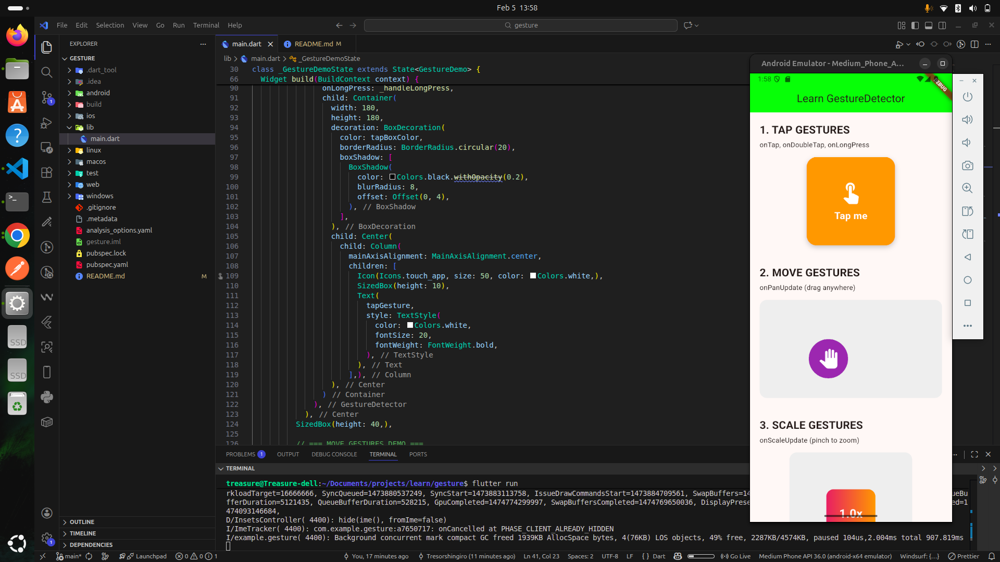

# GestureDetector Demo

A Flutter app demonstrating the GestureDetector widget for detecting and responding to user touch interactions.

## Screenshot



## How to Run

```bash
flutter run
```

## Three Key Gesture Types Demonstrated

1. **Tap Gestures** (`onTap`, `onDoubleTap`, `onLongPress`) - Detects single tap, double tap, and long press interactions on a colored box that changes color based on the gesture type.

2. **Move Gestures** (`onPanUpdate`) - Tracks dragging movements allowing a purple circle to be moved freely within defined boundaries.

3. **Scale Gestures** (`onScaleUpdate`) - Responds to pinch-to-zoom gestures with two fingers, scaling a box between 0.5x and 3.0x with live scale display.
